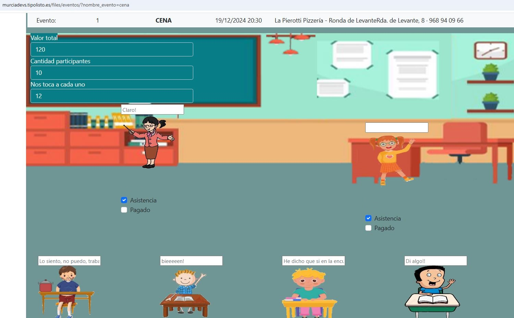

# ¿ Que es eventos ?

Es un programa que intenta implementar la lógica de la organización de un evento, como cenas, fiestas, etc.

## Juega online

https://murciadevs.tipolisto.es/files/eventos/?nombre_evento=cena

# ¿ Como funciona ?

Tenemos la parte backend que es php (que es la 1 que se carga), y la parte frontend que es html, css y javascript.

## La parte backend

1. Creamos y rellenamos la base de datos con los cretae tables e inserts que hay en el archivo database.php
2. Creamos el archivo index.php con los checkboxes
   
   2.1. Enrutamos las solicitudes a https://murciadevs.tipolisto.es/files/eventos

   2.2 obtenemos el evento

   2.3 obtenemos los partipantes

   2.4 Por cada participante de ese evento mostramos su nombre, asistencia, pagado y comentario
   
3. Creamos los archivo para el rest api api/get_evento.php y api/get_all_participantes_evento.php, api/update_asistencia.php, api/update_comentario y api/update_evento.php
   
## La parte frontend

1. Creamos el archivo main.js con los eventos
2. Creamos el archivo main.css con los estilos

